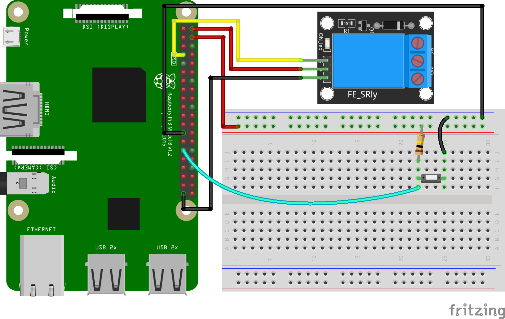

# Lập trình Raspberry pi GPIO

Điều khiển bật hoặc tắt module Relay bằng nút nhấn

## Các phương thức

- NodeJS
  - Bằng module onoff
  - Bằng API
  - Bằng socket.io
- Python
  - Module RPi

## Chuẩn bị

- Raspberry Pi đã được cài đặt hệ điều hành Raspberry Pi OS.
- Raspberry Pi đã được cài đặt NodeJS.
- Có kết nối internet.
- Module Relay và nút nhấn.

## NodeJS

### Module onoff

Kết nối Raspberry Pi với module Relay và nút nhấn.



Tạo một thư mục dự án mới:

```sh
mkdir raspberry-pi-gpio
```

Di chuyển vào thư mục vừa tạo, rồi khởi tạo dự án NodeJS. Trong dòng lệnh bên dưới, nếu không dùng tham số -y, npm sẽ hỏi bạn các thông tin để cấu hình cho dự án, ngược lại thì npm sẽ không hỏi gì cả và giữ các giá trị mặc định trong tệp cấu hình:

```sh
cd raspberry-pi-gpio
npm init -y
```

Sau khi khởi tạo dự án, tiếp tục cài đặt module onoff:

```sh
npm install onoff
```

Tạo một tệp button.js và mở bằng trình soạn thảo văn bản. Sao chép và chèn đoạn mã sau:

```javascript
const Gpio = require("onoff").Gpio;
const relay = new Gpio(4, "out");
const button = new Gpio(5, "in", "rising", { debounceTimeout: 10 });

button.watch((err, value) => {
  if (err) {
    throw err;
  }
  relay.writeSync(relay.readSync() ^ 1);
});

process.on("SIGINT", _ => {
  relay.unexport();
  button.unexport();
});
```

Lưu và thoát chương trình soạn thảo, sau đó chạy tệp:

```sh
node button.js
```

Lưu ý, bạn cần phải cho phép "Remote GPIO" trong mục cấu hình Raspberry Pi hoặc trong raspi-config để chương trình có thể điều khiển chân GPIO.

