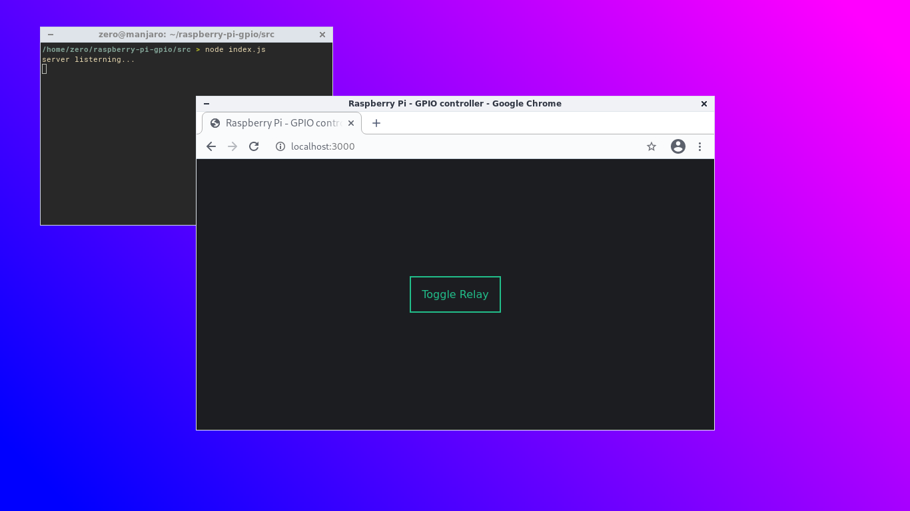
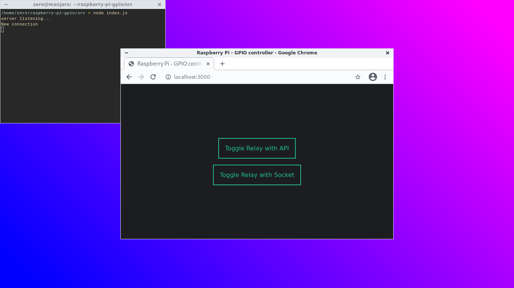

# Lập trình Raspberry pi GPIO

Điều khiển bật hoặc tắt module Relay bằng nút nhấn

## Các phương thức

- NodeJS
  - Bằng module onoff
  - Bằng API
  - Bằng socket.io
- Python
  - Module RPi

## Chuẩn bị

- Raspberry Pi đã được cài đặt hệ điều hành Raspberry Pi OS.
- Raspberry Pi đã được cài đặt NodeJS.
- Có kết nối internet.
- Module Relay và nút nhấn.

## NodeJS

### Module onoff

Kết nối Raspberry Pi với module Relay và nút nhấn.


Tạo một thư mục dự án mới:

```sh
mkdir raspberry-pi-gpio
```

Di chuyển vào thư mục vừa tạo, rồi khởi tạo dự án NodeJS. Trong dòng lệnh bên dưới, nếu không dùng tham số -y, npm sẽ hỏi bạn các thông tin để cấu hình cho dự án, ngược lại thì npm sẽ không hỏi gì cả và giữ các giá trị mặc định trong tệp cấu hình:

```sh
cd raspberry-pi-gpio
npm init -y
```

Sau khi khởi tạo dự án, tiếp tục cài đặt module onoff:

```sh
npm install onoff
```

Tạo một tệp button.js và mở bằng trình soạn thảo văn bản. Sao chép và chèn đoạn mã sau:

```javascript
const Gpio = require("onoff").Gpio;
const relay = new Gpio(4, "out");
const button = new Gpio(5, "in", "rising", { debounceTimeout: 10 });

button.watch((err, value) => {
  if (err) {
    throw err;
  }
  relay.writeSync(relay.readSync() ^ 1);
});

process.on("SIGINT", _ => {
  relay.unexport();
  button.unexport();
});
```

Lưu và thoát chương trình soạn thảo, sau đó chạy tệp:

```sh
node button.js
```

Lưu ý, bạn cần phải cho phép "Remote GPIO" trong mục cấu hình Raspberry Pi hoặc trong raspi-config để chương trình có thể điều khiển chân GPIO.

### API

Trong phần này, chúng ta không điều khiển Relay bằng nút nhấn mà điều khiển từ một website, cụ thể là website này sẽ có một nút nhấn, khi chúng ta nhấn nút trên website thì Relay sẽ bật hoặc tắt.

Trong thư mục dự án NodeJS đã tạo trước đó, cài thêm module Express, module này giúp chúng ta nhanh chóng tạo một máy chủ.

```sh
cd raspberry-gpio
npm install express
```
Tạo một tệp index.js, mở bằng trình soạn thảo văn bản và chèn vào đoạn mã sau:

```javascript
const express = require('express');
const app = express();
const Gpio = require('onoff').Gpio;
const relay = new Gpio(4, 'out');

app.use('/', express.static(__dirname + '/public'));
app.get('/toggle', (request, response) => {
  relay.writeSync(relay.readSync() ^ 1);
  return response.status(200).send('Relay toggled');
});

app.listen(3000, () => {
  console.log('server listerning...');
});
```

Lưu tệp và thoát trình soạn thảo, khởi động máy chủ bằng lệnh:

```sh
node index.js
```

Mở trình duyệt web và truy cập điạ chỉ http://localhost:3000/toggle, bạn sẽ thấy relay được bật hoặc tắt.

Trong tệp index.js, chúng ta đã định nghĩa thư mục public sẽ chứa các tài nguyên dùng để phục vụ cho mọi người ở phía máy khách (client). Do đó, chúng ta tạo thư mục public. Trong thư mục public, tạo tệp index.html và chèn nội dung sau:

```html
<!DOCTYPE html>
<html lang="en">

<head>
  <meta charset="UTF-8">
  <meta name="viewport"
    content="width=device-width, user-scalable=no, initial-scale=1.0, maximum-scale=1.0, minimum-scale=1.0">
  <title>Raspberry Pi - GPIO controller</title>
  <style>
    * {
      box-sizing: border-box;
      font-family: Arial, Helvetica, sans-serif;
    }
    body {
      margin: 0;
    }
    .wrapper {
      width: 100%;
      height: 100vh;
      display: flex;
      flex-direction: column;
      justify-content: center;
      align-items: center;
      background-color: #1C1D21;
    }
    .button {
      padding: 1em;
      border: 2px solid #22BE8A;
      color: #22BE8A;
      text-decoration: none;
    }
    .button:hover {
      background-color: #22BE8A;
      color: #1C1D21;
    }
  </style>
</head>

<body>
  <div class="wrapper">
    <a class="button" href="#" onclick="relayToggle()">
      Toggle Relay
    </a>
  </div>
  <script>
    function relayToggle() {
      fetch('http://localhost:3000/toggle');
    }
  </script>
</body>

</html>
```

Sau khi lưu tệp index.html, mở trình duyệt web và truy cập địa chỉ http://localhost:3000, bạn sẽ thấy trang web mình vừa tạo.



### Socket.io

Trong thư mục dự án đã tạo ở phần trước, mở tệp index.js và sửa lại nội dung như sau:

```javascript
const express = require('express');
const app = express();
const Gpio = require('onoff').Gpio;
const relay = new Gpio(4, 'out');
const http = require("http");
const socketIo = require("socket.io");

app.use('/', express.static(__dirname + '/public'));
app.get('/toggle', (request, response) => {
  relay.writeSync(relay.readSync() ^ 1);
  io.sockets.emit("button_pressed", relay.readSync());
  return response.status(200).send('Relay toggled');
});

const server = http.createServer(app).listen(3000, () => {
  console.log('server listening...');
});

const io = socketIo();
io.attach(server);
io.on('connection', function (socket) {
  console.log('New connection');

  socket.on('web_relay_toggle', function (data) {
    relay.writeSync(relay.readSync() ^ 1);
  })
});
```

Sửa nội dung tệp index.html nằm trong thư mục public như sau:

```html
<!DOCTYPE html>
<html lang="en">

<head>
  <meta charset="UTF-8">
  <meta name="viewport"
    content="width=device-width, user-scalable=no, initial-scale=1.0, maximum-scale=1.0, minimum-scale=1.0">
  <title>Raspberry Pi - GPIO controller</title>
  <style>
    * {
      box-sizing: border-box;
      font-family: Arial, Helvetica, sans-serif;
    }
    body {
      margin: 0;
    }
    .wrapper {
      width: 100%;
      height: 100vh;
      display: flex;
      flex-direction: column;
      justify-content: center;
      align-items: center;
      background-color: #1C1D21;
    }
    .button {
      padding: 1em;
      border: 2px solid #22BE8A;
      color: #22BE8A;
      text-decoration: none;
    }
    .button:hover {
      background-color: #22BE8A;
      color: #1C1D21;
    }
  </style>
</head>

<body>
  <div class="wrapper">
    <a class="button" href="#" onclick="relayToggleAPI()">
      Toggle Relay with API
    </a>
    <a class="button" href="#" style="margin-top: 1em" onclick="relayToggleSocket()">
      Toggle Relay with Socket
    </a>
  </div>
  <script src="/socket.io/socket.io.js"></script>
  <script>
    const socket = io();
    function relayToggleAPI() {
      fetch('http://localhost:3000/toggle');
    }
    function relayToggleSocket() {
      socket.emit("web_relay_toggle");
    }
  </script>
</body>

</html>
```

Sau khi lưu tệp index.html, mở trình duyệt web và truy cập địa chỉ http://localhost:3000, bạn sẽ thấy trang web mình vừa tạo.


